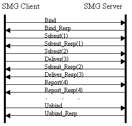
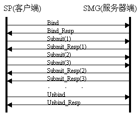
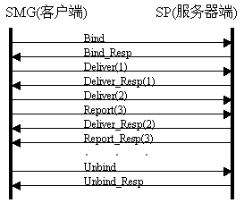

# 应用层小论文
[TOC]


## 小组名单

| 姓名   | 学号          | 工作内容 |
| :--- | :---------- | ---- |
| 欧作松  | 14030110087 | 协议论文 |
| 付林   |             |      |
| 李杉   |             |      |

## 应用层协议概述

应用层使得用户可以访问网络，是主机在网络中使用协议或接口进行通信而定义的抽象层。这层抽象在计算机网络的 TCP/IP 与 OSI 模型中被使用，其下层分别为传输层与表示层。应用层直接和应用程序接口通信并提供常见的网络应用服务，应用层协议定义运行在不同端系统上的应用程序进程如何彼此传递消息，具体地说，一个应用层协议定义了三个方面：
1. 所传递的消息类型。
2. 各种消息的语法，即消息中所能包含的字段及字段的格式和意义。
3. 确定一个进程何时以及如何发出消息或响应所收到消息的规则。

在一个聊天系统中，对使用 TCP/IP 协议的网络而言：网络层解决了主机与主机之间如何通信的问题，确保 IP 数据报可从一台主机传输到另一台主机；而传输层保证了进程与进程之间的通信，实现了比特流有序地从一个进程发往另一个进程；至于怎样通信，则由应用层确定，数据是否需要校验完整性则需要视应用层的协议来确定。

无论是聊天文字、表情图标、图像信息还是其他，只要是数字化的数据，在计算机中的表示方式都是比特，网络通信中传输的数据也仅仅是比特流。要实现这些数据的传输，需要在应用层规定相应的编码规范，在进行网络传输之前把数据按照这套编码规范转换成二进制消息，到达目的地后再根据协议内容解码为相应的信息。如图所示：

```md
     encode           send           recv          decode
信息 --------> 二进制 ------> 网络传输 ------> 二进制 --------> 信息
```

点对点的聊天系统中，原则上不需要引入中心节点，因为一个 IP 地址唯一地标识了一台在网络系统上的设备。但因为目前 IPv4 地址资源的短缺、IPv6 地址尚未普及，以及运营商级 NAT 的部署，要想实现任意两台主机之间的通信，必须引入中心节点，网络模型变为了星型，也带来了一点好处：多人聊天室的实现变得更为容易。

至于离线信息的转发，必须依靠中心服务器。在整个消息传递的过程中，发送方无需关心接受方是否在线，只需要把消息发往中心服务器。中心服务器接收消息发送方的请求，并检查接收方当前是否在线，如果在线则直接向接收方发送消息，若不在线则先存储起来，等到接收方上线后再将消息送达。如何知晓客户端在线，就必须依赖登录时的注册机制了。如图所示：

```md
       login               register
客户端 -------> 中心服务器 ----------> 客户端状态
                            |check
                            v
                           消息
                            |available
                            v
                           发送

       send              check
发送方 ------> 中心服务器 -------> 接受方状态
                                    |
                               +----+----+
                        offline|         |online
                               v         v
                            存储消息   发送消息
```

中心服务器要想获知客户端的状态，则需要客户端主动告知，这点可以利用心跳包来实现——每隔一段时间发送一个心跳包，若服务器超出一定的时间范围未接受到任何心跳包，便可以认为此客户端不在线，将客户端的状态修改为离线。

## 应用层协议数据结构

### 分析协议内容

中国电信使用的是 SMGP 协议，SMGP 协议底层通过 TCP/IP 协议传递数据，网关与 CP 之间通信连接采用端口号 8890，网关与网关通信连接采用的端口号 8900。

中国联通使用的是 SGIP 协议，SGIP 有两种具体的实现方式：SGIP、HTTP，SMG 和 GNS、以及 SMG 和 SMG 之间采用专用 SGIP 方式作为承载协议；而 SP 和 SMG 的通信同时支持专用 SGIP 方式和通用 HTTP 方式两种承载协议。采用专用 SGIP 承载方式时，SMG 和 SMG、SP 和 SMG 之间使用的端口号是 8801，GNS 监听 SMG 的端口号为 8802，SMG 监听 GNS 的端口号为 8803，主 GNS 和备用 GNS 之间的端口号为 8804，SMG 之间的测试用端口号为 8810。HTTP 承载方式只适用于 SP 和 SMG 的通信中，不需要转码的连接认证命令，使用的端口是 80。

两协议中数据包都分为包头和包体部分，其中包头部分是固定的，是所有数据包的必要部分，标识数据包的长度、标识操作序列号、操作的类型。包体部分具体定义各种不同操作类型包所需要参数字段。

SMGP 数据包的基本数据类型有两种：无符号整数(Integer)与定长字符串(Octet String)。数据包分为包头与包体两部分。包头定义了数据包的长度、请求类型与序列号，不同的请求类型具有不同的包体结构，对消息类型有确定的编码规范。

SGIP 协议中定义了三种消息：基于 HTTP 的消息，基于专用 SGIP 的消息和鉴权消息。在基于 HTTP 的消息中，客户端采用 POST 方法向服务器端发送请求，服务端返回应答。专用 SGIP 协议中定义的数据包格式与 SMGP 相似，定义了同样的基本数据类型与包头格式，包体也因请求类型而异。至于鉴权消息，用于 SMG 向计费中心请求对一个手机用户进行鉴权，由 CheckUser 命令和 CheckUser_Resp 应答两部分组成。

在 MO/MT 业务执行过程中，对信息的解读都是通过解读数据包来实现的。包头的字段长度是固定的，对此的解读可获知数据包的长度、请求类型以及序列号。不同的请求类型，包体不一样，每种请求类型中的各种字段长度如何，都有相应的规范，要么固定长度，要么在包体中说明。总的来说：数据包分为两部分，包头声明了数据包的解读方式，包体是具体的内容。

## 系统互联

两个短息网关系统直接互联是不可行的，但可以增加一个中间层来解决无法互联问题。
原因：两个短信网关系统使用的应用层协议不一样，直接互联，双方无法解析对方的数据包。

###　解决方案

理论：
计算机科学领域的任何问题都可以通过增加一个间接的中间层来解决！
网络协议是分层协议，使用封装的方法将消息从低层向高层(或从高层向低层)传递，这个过程是通过相邻两层的接口来实现的，每一层接口都定义了该层必须向上层提供的信息和服务。
虽然两个短信网关系统使用的协议不同，但无论是什么样的短信网关系统，实现的功能是一致的，他们的区别仅仅是应用层实现方式的区别。

方案：
设置数据交换中心，用于不同短信网关协议的转换。行为：
1. 接收短信网关系统 A 网关发送(转发)过来的数据包
2. 解析数据包内容，并使用另一短信网关系统 B 的协议重新封装
3. 把重新封装后的数据包发往 B 网关系统的某一网关

## 短信网关系统框架

以中国联通的 SMG 为例

### 短信网关系统框架拓扑结构



短信网关由服务提供商(SP)、短信网关、短信中心、汇接网关四部分组成。各部分功能如下：

* 服务提供商(Service Provider, SP) -- 短信信息服务的信息提供者
* 短信网关(Short Message Gateway, SMG) -- 提供SP与短信中心之间数据交换的通道
* 短信中心(Short Message Service Center, SMSC) -- 利用信令网将短消息发送给手机用户
* 汇接网关(Gateway Name Server, GNS) -- 提供短信网关的路由查询

SMG 是具有短消息转发功能的短消息网关。全国可以有多个 SMG 网关，SMG 网关之间通过互联网等方式实现网络互联。每一个 SMG 同时与多个 SMSC 以及多个 SP 连接。全网具有唯一有效的 GNS，GNS 负责全局路由表的维护与更新；为了确保路由表存储的安全性，网络中设置主备用 GNS，两个 GNS 要保持一致性。

### 异地短信处理流程

和 SMG 平台之间相连的 SMSC 称作本地 SMSC，和异地 SMG 平台相连的 SMSC 称作异地 SMSC。
和 SMG 平台之间相连的 SP 称作本地 SP，和异地 SMG 平台相连的 SP 称作异地 SP。
异地短信可分为: 
* 从本地 SMSC 发往异地 SP
* 从本地 SP 发往异地 SMSC
  他们都是把需要发送的消息先由本地 SMG 路由到异地 SMG，再由异地 SMG 转发。大致流程如下：
```md
SMSC1A / SP1X ----> SMG1 ----> SMG2 ----> SP2Y / SMSC2A 
```

异地短信的传输过程，可分为 SP 与 SMG、SMG 与 SMG、SMG 与 SMSC 三部分。

#### SP 与 SMG

SP 做为客户端时，通信流程如下：



SP 作为服务端时：



SMG 与 SMG 通信流程：


以上可以归结为 Bind 操作、Submit 操作、Deliver 操作、Report 操作与 Unbind 操作。

具体流程如下：

1. 客户端首先发送 Bind 命令，服务器端收到 Bind 命令后，对命令发送方根据字段 Login Type 与 Login Name、Login Password 判断登录类型与身份鉴权，然后返回 Bind_Resp 应答
2. 如果 Bind_Resp 中字段 Result 为 0，则客户端接着进行 Submit 操作
  * 在 SP 和 SMG 的通信中，SP 用 Submit 命令向 SMG 提交 MT 短消息。SMG 接收到 Submit 命令，会返回 Submit_Resp 应答，根据 Submit 命令中的付费号码字段 Charge Number 判断出该命令是否应从本地 SMSC 发送，如果属于本地发送，则直接发送到相应的 SMSC，否则路由至相应的 SMG
  * 在 SMG 和 SMG 的通信中，Submit 命令用于 SMG 客户端向服务器端路由从 SP 收到的 MT 短消息。服务器端接收到 Submit 命令后，再发送到与之相连的目的 SMSC
3. 同样，鉴权成功后也可执行 Deliver 操作
  * 在 SP 和 SMG 的通信中，SMG 用 Deliver 命令向 SP 发送一条 MO 短消息。SP 接收到 Deliver 命令，会返回 Deliver_Resp 应答。SMG 根据 Deliver 命令中的字段 SP Number，判断出该服务属于和哪一个 SMG 相连接的 SP，如果属于本地 SP，则直接发送到 SP，否则路由至相应的 SMG
  * 在 SMG 和 SMG 的通信中，Deliver 命令用于 SMG 客户端向服务器端路由 MO 短消息。服务器端接收到 Deliver 命令后,再发送到与之相连的目的 SP
4. 先前的 Submit 或 Deliver 命令的当前状态则由操作 Report报告，Report 命令的接收方需要向发送方返回 Report_Resp 命令
5. 所有消息完毕后，需要进行 Unbind 操作

### 将西安网关并联如系统

解决方案:

在汇接网关加入西安网关的表项目中，更新 GNS 中的路由表信息，由 GNS 将路由表更新到各个区域的短信网关中。

## 总结及意见的工作总结

欧作松：通过此次应用层小论文的工作，对应用层的了解有了更深刻的认识，并深入研究了两篇不同系统的短消息网关的应用层协议，对短信信息服务的各个参与者有了一定的了解，尤其是短信网关的应用层协议设计的重要性，最后自主思考了不同系统之间的互联方案。
付林：对应用层的作用有了更进一步的理解。通过对短信网关协议的研读，对短信业务的实现有了进一步的理解。
