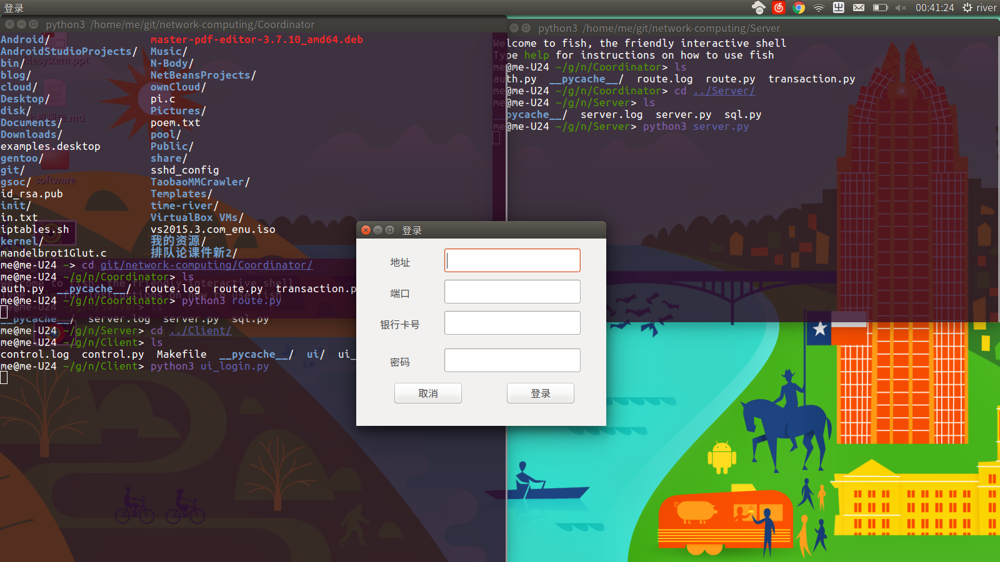
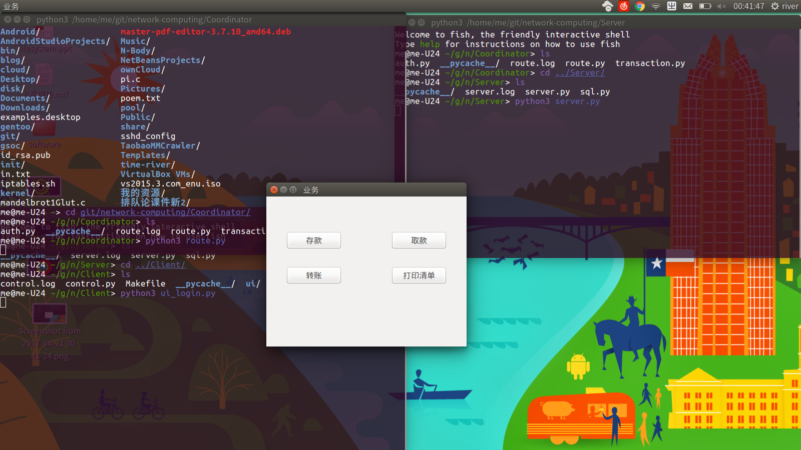
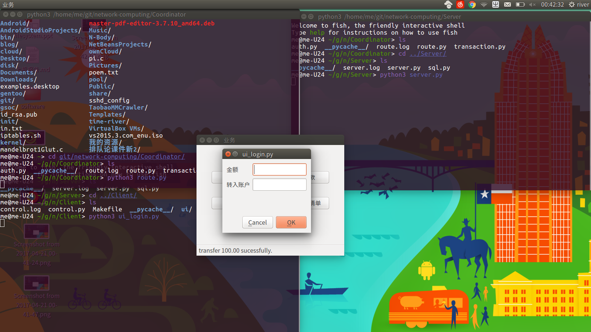
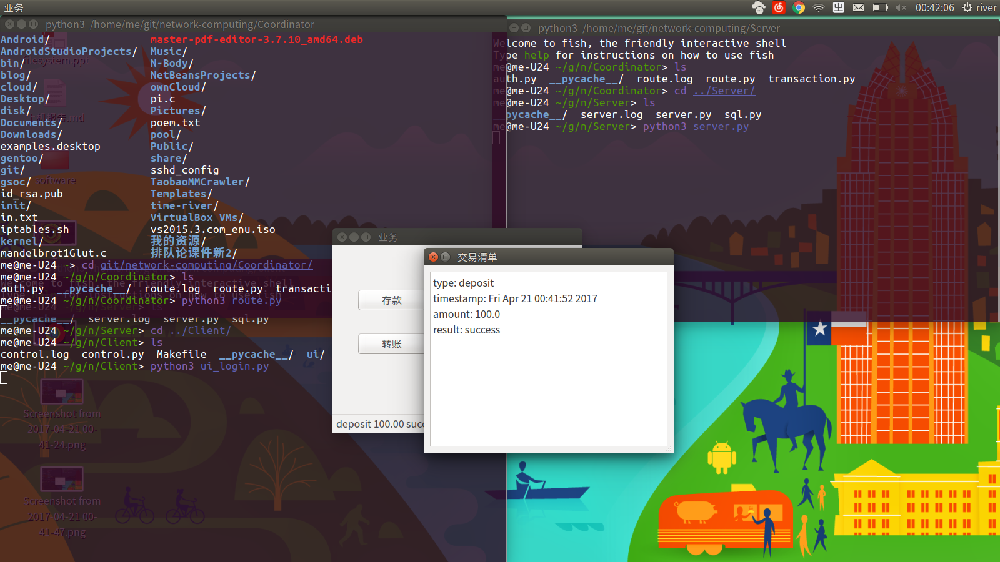
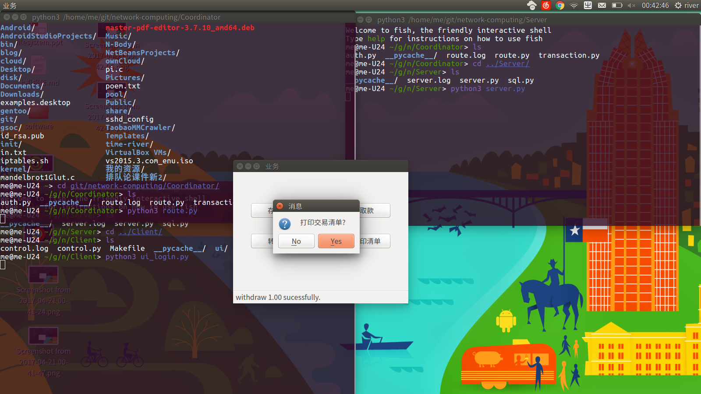

# <center>ATM机模拟系统上机报告</center>

# 目录

1. [协议设计](##协议设计)
   1.1. [如何定位服务器](###如何定位服务器)
   1.2. [应用层协议结构内容、解析方法以及示例](###应用层协议结构内容、解析方法以及示例)
   1.3. [请求与响应流程的详细步骤](###请求与响应流程的详细步骤)
   1.4. [系统崩溃策略](###系统崩溃策略)
2. [遇到的问题及解决方案](##遇到的问题及解决方案)
   2.1. [事务操作中客户端或服务端崩溃了怎么办?](###事务操作中客户端或服务端崩溃了怎么办?)
   2.2. [采用二阶段提交协议后, ATM 或 Server 可能崩溃的时刻有哪些?会导致怎样的影响?怎么应对?](###采用二阶段提交协议后, ATM 或 Server 可能崩溃的时刻有哪些?会导致怎样的影响?怎么应对?)
   2.3. [系统如何满足用户在业务功能实现后必须拿到交易清单情况?](###系统如何满足用户在业务功能实现后必须拿到交易清单情况?)
   2.4. [系统崩溃后的用户等待?](###系统崩溃后的用户等待?)
3. [测试结果](##测试结果)
4. [思考题](##思考题)
   4.1. [账号路由](###帐号路由)
   4.2. [交叉互联结果预测](###交叉互联结果预测)
   4.3. [应用层协议的作用](###应用层协议的作用)
   4.4. [对 C/S 计算模式的认识](###对 C/S 计算模式的认识)
5. [对课程内容设置、讲授方式及教师课堂讲解的意见和建议](##对课程内容设置、讲授方式及教师课堂讲解的意见和建议)

<div style="page-break-after: always;"></div>

## 协议设计

### 客户端如何定位服务器

客户端静态绑定服务器的 IP 地址 与 PORT,由于客户端与服务端中间加入了一个协调者（下文会提到），因此客户端实际上绑定的是协调者的地址与端口。

### 应用层协议结构内容、解析方法以及示例

采用基于 TCP 的应用层协议。TCP 是基于点到点的可靠的传输层协议，无需考虑数据的可靠性问题。应用层协议采用基于 Key-Value 模式的 JSON 数据格式来实现，JSON有其固定的解析方式，大大简化了解析的工作。具体的操作有登录、取款，存款，转账。

#### 登录

客户端请求参数:

| 参数       | 意义    | 备注      |
| -------- | ----- | ------- |
| type     | 协议类型  | 值为 '00' |
| bankcard | 银行卡号  |         |
| password | 银行卡密码 |         |

服务端返回参数:

| 参数       | 意义   | 备注            |
| -------- | ---- | ------------- |
| type     | 协议类型 | 值为 '01'       |
| status   | 状态标志 | 0 代表成功，1 代表失败 |
| token    | 会话标识 |               |
| deadline | 到期时间 |               |
| msg      | 消息   |               |

示例:

```json
/* Client 请求格式 */
{
    "type": '00',
    "bankcard": "0123456789",
    "password": "0123456789"
}

/* Server 返回格式 */
{
    "type": '01',
    "status": 0,
    "token": "1995172d456c6f0266142f8175eaafca",
    "deadline": "1491567752",
    "msg": "Authentication success."
}
```


#### 存款

客户端请求参数:

| 参数       | 意义   | 备注      |
| -------- | ---- | ------- |
| type     | 协议类型 | 值为 '20' |
| token    | 会话标识 |         |
| bankcard | 银行卡号 |         |
| amount   | 金额   |         |

服务端返回参数:

| 参数     | 意义   | 备注            |
| ------ | ---- | ------------- |
| type   | 协议类型 | 值为 '21'       |
| token  | 会话标识 |               |
| status | 状态标志 | 0 代表成功，1 代表失败 |
| msg    | 消息   |               |

示例:

```json
/* Client 请求格式 */
{
    "type": "20",
    "token": "1995172d456c6f0266142f8175eaafca",
    "bankcard": "0123456789",
    "amount": 100
}

/* Server 返回格式 */
{
    "type": "21",
    "token": "1995172d456c6f0266142f8175eaafca",
    "status": 0,
    "msg": "Success"
}
```

#### 取款

客户端请求参数:

| 参数       | 意义   | 备注      |
| -------- | ---- | ------- |
| type     | 协议类型 | 值为 '30' |
| token    | 会话标识 |         |
| bankcard | 银行卡号 |         |
| amount   | 金额   |         |

服务端返回参数:

| 参数     | 意义   | 备注            |
| ------ | ---- | ------------- |
| type   | 协议类型 | 值为 '31'       |
| token  | 会话标识 |               |
| status | 状态标志 | 0 代表成功，1 代表失败 |
| msg    | 消息   |               |

示例:

```json
/* Client 请求格式 */
{
    "type": "30",
    "token": "1995172d456c6f0266142f8175eaafca",
    "bankcard": "0123456789",
    "amount": 100
}

/* Server 返回格式 */
{
    "type": "31",
    "token": "1995172d456c6f0266142f8175eaafca",
    "status": 0,
    "msg": "Success"
}
```

#### 转账

客户端请求参数:

| 参数          | 意义        | 备注      |
| ----------- | --------- | ------- |
| type        | 协议类型      | 值为 '40' |
| token       | 会话标识      |         |
| bankcard    | 银行卡号      |         |
| transferred | 转入账户的银行卡号 |         |
| amount      | 金额        |         |

服务端返回参数:

| 参数     | 意义   | 备注            |
| ------ | ---- | ------------- |
| type   | 协议类型 | 值为 '41'       |
| token  | 会话标识 |               |
| status | 状态标志 | 0 代表成功，1 代表失败 |
| msg    | 消息   |               |

示例:

```json
/* Client 请求格式 */
{
    "type": '40',
    "token": "1995172d456c6f0266142f8175eaafca",
    "bankcard": "0123456789",
    "transferred": "1234567890",
    "amount": 100
}

/* Server 返回格式 */
{
    "type": '41',
    "token": "1995172d456c6f0266142f8175eaafca",
    "status": 0,
    "msg": "Success"
}
```

### 请求与响应流程的详细步骤

登录、取款，存款，转账，可进一步划分为非事务操作(登录)与事务操作(取款、存款、转账)。

#### 非事务操作

详细步骤如下:

1. 客户端使用银行卡号与密码请求登录
2. 服务端收到请求后，验证银行卡号与密码
3. 验证成功后，服务端会签发一个 token，再把这个 token 发送给客户端；若验证失败，则返回错误原因
4. 客户端收到 token 后把它存储起来，每次向服务端请求资源的时候带着服务端签发的 token
5. 服务端收到请求后，验证客户端请求里面的 token
6. 服务端返回消息时，也会带上 token

关于参数 token:

* 每次打开客户端，都会发起登录请求，获取新的 token
* 因客户端崩溃导致 token 的存在，客户端登录成功后覆盖之
* 关闭客户端，即删除当前的 token

关于参数 deadline:

* 初始值为当前时间+一天(86400秒)
* 当前时间大于等于 deadline 的时候，token 无效，服务端删除该值

#### 事务操作

使用了二阶段提交协议保证分布式事务中的一致性。详细步骤如下：

```
ATM send request  -->     Coordinator
                               |
                               v
---------------------- Transaction Start -------------------------
ATM recv Enquire  <--  First stage start  -->  Server recv Enquire
 |                                                              |
 |                     local transaction                        | 
 v                                                              v
ATM send ACK  -->    First stage complete   <--    Server send ACK
                               |
                               v
ATM recv commit  <-- Second stage start   -->   Server recv commit
 |                                                              |
 |                local transaction complete                    |         
 v                                                              v
ATM send ACK  -->   Second stage complete   <--    Server send ACK
                               |
                               v
---------------------- Transaction End ---------------------------
                               |
                               v
ATM recv result  <--      Coordinator
```

### 系统崩溃策略

这是 CAP 理论中的一致性（Consistency）问题，解决这类问题的协议和算法中，比较著名的有二阶提交协议（Two Phase Commitment Protocol）、三阶提交协议（Three Phase Commitment Protocol）和Paxos算法。
这里使用二阶段提交协议解决事务操作中客户端或服务端崩溃的情况。二阶段提交主要保证了分布式事务的原子性，即所有节点要么全做要么全不做。

#### 二阶段提交

所谓的两个阶段是指：

* 第一阶段——准备阶段（投票阶段）
* 第二阶段——提交阶段（执行阶段）

##### 假设

二阶段提交算法的成立基于以下假设：

* 该分布式系统中，存在一个节点作为协调者(Coordinator)，其他节点作为参与者(Cohorts)。且节点之间可以进行网络通信。
* 所有节点都采用预写式日志，且日志被写入后即被保持在可靠的存储设备上，即使节点损坏不会导致日志数据的消失。
* 所有节点不会永久性损坏，即使损坏后仍然可以恢复。

##### 二阶段提交步骤

###### 准备阶段

事务协调者(事务管理器)给每个参与者(资源管理器)发送Prepare消息，每个参与者要么直接返回失败(如权限验证失败)，要么在本地执行事务，写本地的redo和undo日志，但不提交，到达一种“万事俱备，只欠东风”的状态。

三个步骤：

1. 协调者节点向所有参与者节点询问是否可以执行提交操作(vote)，并开始等待各参与者节点的响应。
2. 参与者节点执行询问发起为止的所有事务操作，并将Undo信息和Redo信息写入日志。（注意：若成功这里其实每个参与者已经执行了事务操作）
3. 各参与者节点响应协调者节点发起的询问。如果参与者节点的事务操作实际执行成功，则它返回一个”同意”消息；如果参与者节点的事务操作实际执行失败，则它返回一个”中止”消息。

###### 提交阶段

如果协调者收到了参与者的失败消息或者超时，直接给每个参与者发送回滚(Rollback)消息；否则，发送提交(Commit)消息；参与者根据协调者的指令执行提交或者回滚操作，释放所有事务处理过程中使用的锁资源。(注意:必须在最后阶段释放锁资源)

两种情况：

* 当协调者节点从所有参与者节点获得的相应消息都为”同意”时:


1. 协调者节点向所有参与者节点发出”正式提交(commit)”的请求。
2. 参与者节点正式完成操作，并释放在整个事务期间内占用的资源。
3. 参与者节点向协调者节点发送”完成”消息。
4. 协调者节点受到所有参与者节点反馈的”完成”消息后，完成事务。

* 如果任一参与者节点在第一阶段返回的响应消息为”中止”，或者 协调者节点在第一阶段的询问超时之前无法获取所有参与者节点的响应消息时:


1. 协调者节点向所有参与者节点发出”回滚操作(rollback)”的请求。
2. 参与者节点利用之前写入的Undo信息执行回滚，并释放在整个事务期间内占用的资源。
3. 参与者节点向协调者节点发送”回滚完成”消息。
4. 协调者节点受到所有参与者节点反馈的”回滚完成”消息后，取消事务。

不管结果如何，第二阶段都会结束当前事务。

###### 结果

二阶段提交看起来确实能够提供原子性的操作，但是不幸的事，二阶段提交还是有几个缺点的：

* 同步阻塞问题。执行过程中，所有参与节点都是事务阻塞型的。当参与者占有公共资源时，其他第三方节点访问公共资源不得不处于阻塞状态。
* 单点故障。由于协调者的重要性，一旦协调者发生故障。参与者会一直阻塞下去。尤其在第二阶段，协调者发生故障，那么所有的参与者还都处于锁定事务资源的状态中，而无法继续完成事务操作。（如果是协调者挂掉，可以重新选举一个协调者，但是无法解决因为协调者宕机导致的参与者处于阻塞状态的问题）
* 数据不一致。在二阶段提交的阶段二中，当协调者向参与者发送 commit 请求之后，发生了局部网络异常或者在发送 commit 请求过程中协调者发生了故障，这回导致只有一部分参与者接受到了 commit 请求。而在这部分参与者接到 commit 请求之后就会执行 commit 操作。但是其他部分未接到 commit 请求的机器则无法执行事务提交。于是整个分布式系统便出现了数据部一致性的现象。
* 二阶段无法解决的问题：协调者再发出 commit 消息之后宕机，而唯一接收到这条消息的参与者同时也宕机了。那么即使协调者通过选举协议产生了新的协调者，这条事务的状态也是不确定的，没人知道事务是否被已经提交。

##### 二阶段提交协议格式

第一阶段提交:

| 参数       | 意义      | 备注     |
| -------- | ------- | ------ |
| sequence | 事务序列号   |        |
| msg      | JSON 数据 | 所执行的操作 |

第一阶段返回结果:

| 参数       | 意义    | 备注   |
| -------- | ----- | ---- |
| sequence | 事务序列号 |      |
| status   | 状态    | 执行结果 |

第二阶段提交:

| 参数       | 意义    | 备注            |
| -------- | ----- | ------------- |
| sequence | 事务序列号 |               |
| status   | 状态    | 0 代表执行，1 代表回滚 |

第二阶段返回结果:

| 参数       | 意义    | 备注   |
| -------- | ----- | ---- |
| sequence | 事务序列号 |      |
| status   | 状态    | 执行结果 |

#### ATM 机 / Server 崩溃

应对策略： 根据日志确定执行到了哪一阶段
* 第一阶段 ACK 完成前，回滚
* 第一阶段 ACK 完成后、第二阶段 RECV 前，不存在该情况(假设)
* 第二阶段 RECV 后，继续执行，直至释放资源，发送 ACK(假设协调者正常)

## 遇到的问题及解决方案

### 事务操作中客户端或服务端崩溃了怎么办？

这是 CAP 理论中的一致性（Consistency）问题，解决这类问题的协议和算法中，比较著名的有二阶提交协议（Two Phase Commitment Protocol）、三阶提交协议（Three Phase Commitment Protocol）和 Paxos 算法。
采用二阶段提交协议，可以具有较高的可靠性，最终一致性需要实现 Paxos 算法。

### 采用二阶段提交协议后，ATM 或 Server 可能崩溃的时刻有哪些？会导致怎样的影响？怎么应对？

ATM 可能崩溃的时刻：

1. 业务请求发送前
2. 业务请求发送之后，收到协调者询问之前
3. 收到协调者询问之后，发送 ACK 之前
4. 发送 ACK 之后，收到协调者确认之前
5. 收到协调者确认之后，发送 ACK 之前
6. 发送 ACK 之后，收到结果前
7. 收到结果后

Server 可能崩溃的时刻：

1. 收到协调者询问之前
2. 收到协调者询问之后，发送 ACK 之前
3. 发送 ACK 之后，收到协调者确认之前
4. 收到协调者确认之后，发送 ACK 之前
5. 发送 ACK 之后

影响：

假定：本地事务一定可以执行成功(失败后可以根据日志回滚)，代码会正常运行；因此，分布式事务只可能在 send / rece 处出现问题。

1. 因协调者的存在，只要第一阶段结束，协调者未收到执行成功的确认(或超时未收到消息)，参与者都能够保证一致性。
2. 参与者收到第二阶段确认前宕机，会导致数据不一致。
3. 参与者执行 commit 时候宕机， 协调者收到所有参与者节点反馈的完成消息之后，才完成事务，不影响。
  4. 发送事务完成消息之后宕机，事务已经完成，无影响。

但是，协调者发送 commit 之后宕机，唯一接收到这条消息的参与者也宕机了，事务就会变得不确定。

### 系统如何满足用户在业务功能实现后必须拿到交易清单情况？

日志的存在，可以保证后续如何进行。

### 系统崩溃后的用户等待？

协调者正常工作，服务器崩溃不影响；客户端崩溃用户无需等待。

## 测试结果











## 思考题

### 帐号路由

针对不同地区（异地支取、存储）、不同银行（跨行支取、存储）的业务，其后台用户业务数据存储可能并非由与ATM机直连的银行业务系统负责管理，需将该请求转发至负责管理的银行业务系统。

1. 如何识别账号所属银行系统？
  首先根据卡号的前6位数字代表发卡行标识代码，也叫BIN号，不同的BIN号代表了不同的银行卡组织和卡片级别，判断此帐号属于哪家银行（此处默认同一银行的数据库一致）。

2. 如何找到该系统并转发请求？

对于同一银行的异地支取、存储业务，设置一个中央服务器。可通过银行卡号，查询帐号归属地数据库，并将请求转发中央服务器，由中央服务器协助完成。
对于跨行的支取业务，设置统一的银行管理机构(比如银联)，利用此机构来寻找对应的银行系统，并通过它协助完成请求。

3. 负责管理的银行业务系统在处理完毕后，如何返回处理结果？

负责管理的银行业务系统具有一张记录参与者的表，业务处理完毕，通过查询该表找出目的地。

4. 系统崩溃
  二阶段协议可以解决系统崩溃问题。

### 交叉互联结果预测

预测是可行的。只需要其他开发小组提供其应用层协议即可单独在协调者中加入此转发功能，将数据请求包发往其他小组开发的银行系统，但无法保证系统崩溃时的处理策略，因为本系统在应用层协议的基础上增加了二阶段提交，与其他系统的服务器逻辑不一致。

### 应用层协议作用

用于对应应用程序的通信服务。对于不同的系统其数据库存储方式和服务逻辑可能不一致，但事务是一样的，只需要提供相同的应用层协议便可将同类型的不同的系统互联。

### 对 *C/S* 计算模式的认识

1. 应用服务器运行数据负荷较轻。
  最简单的C/S体系结构的数据库应用由两部分组成，即客户应用程序和数据库服务器程序。二者可分别称为前台程序与后台程序。运行数据库服务器程序的机器，也称为应用服务器。一旦服务器程序被启动，就随时等待响应客户程序发来的请求；客户应用程序运行在用户自己的电脑上，对应于数据库服务器，可称为客户电脑，当需要对数据库中的数据进行任何操作时，客户程序就自动地寻找服务器程序，并向其发出请求，服务器程序根据预定的规则作出应答，送回结果，应用服务器运行数据负荷较轻。
2. 数据的储存管理功能较为透明。
  在数据库应用中，数据的储存管理功能，是由服务器程序和客户应用程序分别独立进行的，前台应用可以违反的规则，并且通常把那些不同的（不管是已知还是未知的）运行数据，在服务器程序中不集中实现，例如访问者的权限，编号可以重复、必须有客户才能建立定单这样的规则。所有这些，对于工作在前台程序上的最终用户，是“透明”的，他们无须过问（通常也无法干涉）背后的过程，就可以完成自己的一切工作。在客户服务器架构的应用中，前台程序不是非常“瘦小”，麻烦的事情都交给了服务器和网络。在C/S体系的下，数据库不能真正成为公共、专业化的仓库，它受到独立的专门管理。
3. C/S架构的劣势是高昂的维护成本且投资大。
  首先，采用C/S架构，要选择适当的数据库平台来实现数据库数据的真正“统一”，使分布于两地的数据同步完全交由数据库系统去管理，但逻辑上两地的操作者要直接访问同一个数据库才能有效实现，有这样一些问题，如果需要建立“实时”的数据同步，就必须在两地间建立实时的通讯连接，保持两地的数据库服务器在线运行，网络管理工作人员既要对服务器维护管理，又要对客户端维护和管理，这需要高昂的投资和复杂的技术支持，维护成本很高，维护任务量大。
  其次，传统的C/S结构的软件需要针对不同的操作系统系统开发不同版本的软件，由于产品的更新换代十分快，代价高和低效率已经不适应工作需要。在JAVA这样的跨平台语言出现之后，B/S架构更是猛烈冲击C/S，并对其形成威胁和挑战。

## 对课程内容设置、讲授方式及教师课堂讲解的意见和建议

课堂以及拓展课外的内容，有助于增加对业务层面的认知，增强代码的鲁棒性。课堂讲授的方式挺好的，只是缺乏必要的锻炼，往往意识不到内容的重要性。建议再度增加实际工程项目的讲解。
